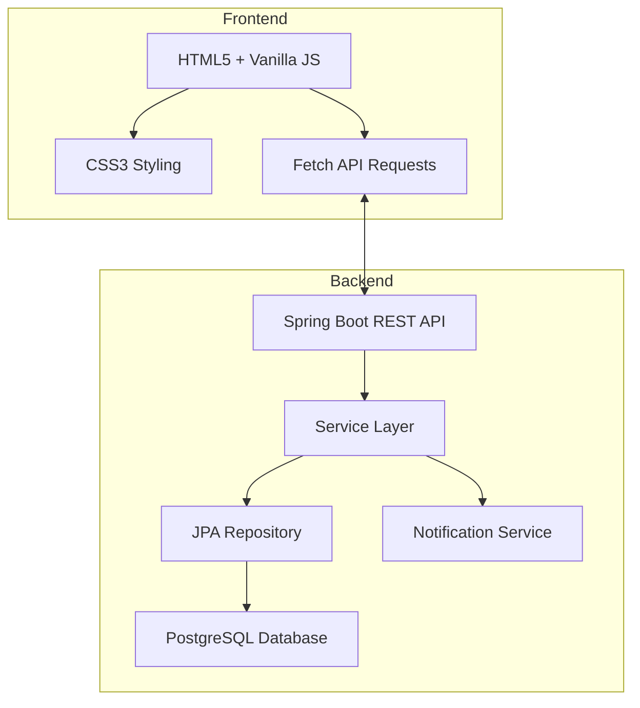

---

# Ticket Management System

A lightweight and efficient ticket dashboard system built with **Spring Boot (Java)** and **vanilla JavaScript**.
Designed for single-account access, it offers real-time monitoring, email alerts, and sound notifications through a simple yet responsive interface.


---

## Overview

This project is a simple internal tool for managing tickets with a single dashboard.
It includes essential ticket CRUD operations, live updates, and notifications without user management complexity.

---

## Screenshot


---


## Features

* Single admin dashboard
* Real-time ticket monitoring
* Email notifications
* Sound-based alerts
* Responsive layout
* Docker-ready deployment

---

## System Architecture



---

## Technology Stack

| Layer      | Technology              |
| ---------- | ----------------------- |
| Backend    | Java 17+, Spring Boot 3 |
| Database   | PostgreSQL 15+          |
| Frontend   | HTML5, CSS3, JavaScript |
| Container  | Docker, Docker Compose  |
| Build Tool | Maven                   |

---

## Setup

### Docker Compose

```bash
docker-compose up --build
```

### Manual Run

```bash
git clone https://github.com/justrhey/ticket-management-system.git
cd ticket-management-system
mvn clean install
mvn spring-boot:run
```

### Database

```sql
CREATE DATABASE ticketdb;
CREATE USER ticketuser WITH PASSWORD 'securepassword';
GRANT ALL PRIVILEGES ON DATABASE ticketdb TO ticketuser;
```

---

## API Overview

| Method | Endpoint            | Description       |
| ------ | ------------------- | ----------------- |
| GET    | `/api/tickets`      | Fetch all tickets |
| POST   | `/api/tickets`      | Create a ticket   |
| PUT    | `/api/tickets/{id}` | Update a ticket   |
| DELETE | `/api/tickets/{id}` | Delete a ticket   |

---

## Example Request

```bash
curl -X POST http://localhost:8080/api/tickets \
  -H "Content-Type: application/json" \
  -d '{"subject":"Issue","fullName":"User","intent":"System Error","priority":"HIGH"}'
```

---

## Acknowledgments

* Spring Boot and PostgreSQL community
* Virspacio Co-Working Space IT Dept (concept origin)
* Reference: user-registration-service

---

<div align="center">

**Made by [justrhey](https://github.com/justrhey)**
[Back to Top](#ticket-management-system)

</div>
